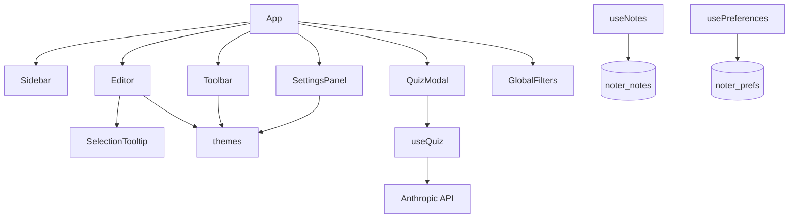

# Project Handoff: Muizo

**Purpose:** Give another agent (or human) enough context to work on architecture, features, bugs, and next steps without re-exploring the codebase.

**Last updated:** 2026-05-21  
**Workspace:** `/Users/fdc-clarence-web/Desktop/notes`  
**App root:** `/Users/fdc-clarence-web/Desktop/notes/Muizo`  
**Product name (UI):** Muizo  
**Legacy naming in code:** `noter_*` localStorage keys; npm package `muizo`

---

## 1. Executive summary

**Muizo** is a **client-only** note-taking SPA with a warm **parchment / stationery** aesthetic. Users write in a `contentEditable` editor with ruled surfaces, fonts, writing tools, ink colors, and **text highlighting**. Notes persist in **browser localStorage**. An optional **AI quiz** calls the **Anthropic Messages API** from the browser.

There is **no backend**, **no auth**, **no routing**, and **no database**.

Recent work (commits on `main`): scaffold → quiz → highlighter → UI polish (sidebar collapse, settings layout, topic prefix, title extraction).

---

## 2. Product intent

| Goal | Status |
|------|--------|
| Tactile writing (ruled lines, paper textures) | Done |
| Multiple notes + sidebar search | Done |
| Preferences persist on refresh | Done |
| Export notes JSON (⌘/Ctrl+S) | Done |
| AI quiz from note content | Done (needs `VITE_ANTHROPIC_API_KEY`) |
| Text highlighting | Done — toolbar color picker + selection tooltip |
| Auto title from first line | Done — `title` synced on content save |
| Collapsible sidebar | Done — `sidebarOpen` pref |
| Server sync / multi-device | Not started |
| Rich-text toolbar (bold, lists) | Not started |

**Aesthetic:** Parchment chrome (`parchment.css`) on sidebar, topbar, settings. Editor uses per-surface colors from `themes.js`.

---

## 3. Repository layout

```
notes/
├── README.md                 # Stub ("# notes")
├── project_handoff.md        # This file
└── Muizo/
    ├── package.json
    ├── vite.config.js
    ├── tailwind.config.js
    ├── index.html            # Caveat Google Font
    ├── public/assets/napkin.png
    └── src/
        ├── main.jsx
        ├── App.jsx
        ├── index.css         # Tailwind directives
        ├── styles/parchment.css
        ├── config/
        │   ├── themes.js
        │   └── app.js        # Mostly unused
        ├── hooks/
        │   ├── useNotes.js
        │   ├── usePreferences.js
        │   └── useQuiz.js
        └── components/
            ├── GlobalFilters.jsx
            ├── Sidebar.jsx
            ├── Toolbar.jsx
            ├── Editor.jsx
            ├── SelectionTooltip.jsx
            ├── SettingsPanel.jsx
            ├── QuizModal.jsx
            └── AppShell.jsx    # DEAD CODE — not imported
```

**~2,680 lines** across source files (excluding `node_modules` / `dist`).

---

## 4. Tech stack

| Layer | Choice |
|-------|--------|
| UI | React 19.2.6 |
| Build | Vite 5.4.21 (README incorrectly says "Vite 8") |
| Styling | Tailwind 3.4 + `parchment.css` + heavy inline styles |
| State | React hooks only (no Context/Redux) |
| Persistence | `localStorage` |
| AI | Anthropic Messages API (browser `fetch`) |
| Tests | None |

**Scripts:** `npm run dev` | `build` | `preview` | `lint`

---

## 5. Runtime architecture

### Component tree

```
App
├── GlobalFilters          (hidden SVG pencil filter)
├── parch-sidebar-wrap → Sidebar
├── main column
│   ├── Toolbar            (sidebar toggle, quiz, highlight picker, settings)
│   └── Editor | EmptyState | placeholder
├── SettingsPanel          (flex sibling; width 0 ↔ 320px)
└── QuizModal              (when quizOpen)
```

### Data flow

```
usePreferences → prefs → Editor, Toolbar, SettingsPanel
              → setPref → localStorage 'noter_prefs' (immediate)

useNotes → notes[], activeId, activeNote
        → debounced 500ms → localStorage 'noter_notes'

useQuiz → Anthropic API (QuizModal only)
```

### Layout

| Region | Size | Notes |
|--------|------|-------|
| Sidebar | 240px | Collapses to 0 via `.parch-sidebar-wrap--collapsed` |
| Toolbar | 44px | Highlight actions hide while settings open (280ms sync) |
| Settings | 0 / 320px width | In flex row; editor resizes (not `position: fixed`) |
| Editor | flex-1 | Scroll mask fades top/bottom (`FADE_TOP` 40px, `FADE_BOTTOM` 48px) |

---

## 6. Persistence

### `noter_notes` — array of notes

```json
{
  "id": "uuid",
  "title": "first line text, max 60 chars",
  "content": "<p>HTML from contentEditable</p>",
  "createdAt": "ISO-8601",
  "updatedAt": "ISO-8601"
}
```

- First visit: seeds one blank note if storage empty.
- `updateNote`: on `content` change, `title` = `extractTitleFromContent(content)` (first visual line, max 60 chars).
- Sidebar display: `getNoteTitle()` — stored title (30 chars) or first line or `"Untitled"`.
- Debounced save: whole array JSON.stringify after 500ms idle.

### `noter_prefs` — defaults

```js
{
  surface: 'yellow',       // yellow | plain | notebook (napkin hidden)
  font: 'serif',
  tool: 'pen',
  inkColor: 'midnight',
  highlightColor: 'yellow', // 6 colors in themes.js
  sidebarOpen: true,
}
```

- Immediate write on change.
- Migration: `highlightColor === 'none'` → `'yellow'`; `surface === 'napkin'` → `'yellow'`.

### Export

⌘/Ctrl+S downloads `notes.json` (notes only, not prefs).

---

## 7. Editor (`Editor.jsx`)

- **`contentEditable`** stores HTML in `note.content`.
- **Visual only (not in HTML):** `TOPIC_PREFIX` (`"Topic : "`) + placeholder `"Add a topic…"` when empty — uses `textIndent` from measured prefix width.
- **Ruled lines:** `GRID = 36px`; `repeating-linear-gradient` on the editable; `backgroundPosition` offset by `FADE_TOP` (40px).
- **Napkin surface:** `hidden: true` in settings; still in `themes.js`. Renders `.napkin-surface` with `::before` PNG (`/assets/napkin.png`), slight `rotate(0.4deg)`, no ruled lines.
- **`SelectionTooltip`:** on text select, floating Highlight / Remove Highlight; uses `applyHighlight(hex)` → `document.execCommand('hiliteColor')`.
- Hides tooltip when quiz or settings open.

---

## 8. Toolbar (`Toolbar.jsx`)

- Sidebar toggle (← / →).
- **QUIZ ME** — disabled without active note.
- **Highlight color** dropdown (6 swatches) — sets `prefs.highlightColor`; used by selection tooltip.
- **Settings gear** — when settings open, right-side actions unmount/hide until panel close + 280ms delay.
- `data-settings-toggle` for outside-click exclusion in settings.

---

## 9. Highlighting flow

1. User picks default highlight color in toolbar (persisted).
2. User selects text in editor → `SelectionTooltip` appears above selection.
3. **Highlight** applies `prefs.highlightColor` hex via `execCommand`.
4. **Remove Highlight** if selection already inside highlight spans (`isSelectionHighlighted` walks DOM).

Highlight HTML is inline `<span style="background-color: …">` — no sanitization.

---

## 10. Quiz (`useQuiz.js` + `QuizModal.jsx`)

- Model: `claude-sonnet-4-6`
- Env: `VITE_ANTHROPIC_API_KEY` (bundled into client — **not for production** without a proxy)
- Header: `anthropic-dangerous-direct-browser-access: true`
- Strips HTML; expects JSON array `{ question, answer, type: 'short' }`
- Self-graded UI; retake reuses questions

| Error code | Meaning |
|------------|---------|
| `missing_key` | No env key |
| `empty_note` | No plain text |
| `api_error` | HTTP or parse failure |

---

## 11. Theming (`themes.js`)

**Surfaces (settings-visible):** `yellow`, `plain`, `notebook` — napkin has `hidden: true`.

**Fonts:** serif, comic, typewriter, handwritten (Caveat in `index.html`).

**Tools:** pen, pencil, marker, fountainPen, crayon — pencil/crayon use SVG `#pencil-filter` from `GlobalFilters.jsx`.

**Ink:** 9 presets. **Highlights:** 6 presets (yellow default).

---

## 12. Styling systems

1. **Tailwind** — layout utilities (`flex`, `h-screen`, quiz modal).
2. **`parchment.css`** — CSS variables, noise textures on chrome, sidebar collapse, napkin pseudo, editor prefix/placeholder styles.
3. **Inline styles** — editor paper, tooltips, many controls.

---

## 13. Keyboard shortcuts

| Shortcut | Action |
|----------|--------|
| ⌘/Ctrl+N | New note (`App.jsx`) |
| ⌘/Ctrl+S | Download `notes.json` (`App.jsx`) |
| Escape | Close settings / quiz |

---

## 14. Git state

| Item | State |
|------|-------|
| Repo | `notes` on `main`, synced with `origin/main` |
| Recent commits | `24fa558 ui changes`, `b072613 Add highlighter functionality`, `36f9c36 actually 95% done` |
| **Uncommitted** | `Editor.jsx`, `SettingsPanel.jsx`, `themes.js`, `usePreferences.js`, `parchment.css` |
| `project_handoff.md` | Tracked; this rewrite not yet committed |

---

## 15. Run locally

```bash
cd /Users/fdc-clarence-web/Desktop/notes/Muizo
npm install
# Optional for quiz:
echo 'VITE_ANTHROPIC_API_KEY=sk-ant-...' > .env
npm run dev
```

No `.env.example` in repo. Restart dev server after adding `.env`.

---

## 16. Known gaps & debt

| Item | Detail |
|------|--------|
| **AppShell.jsx** | Unused Vite scaffold — safe to delete |
| **Topic prefix** | Visual only; not part of stored title/content semantics |
| **Napkin** | Hidden from settings; legacy users migrated to yellow |
| **API key in client** | Use backend proxy for production |
| **execCommand** | Deprecated; highlight detection is span/style heuristic |
| **HTML paste** | No sanitization |
| **README** | Says Vite 8; actual 5.4.21 |
| **Storage keys** | Still `noter_*` vs product name Muizo |
| **localStorage quota** | No error handling |
| **EmptyState** | Rare — app seeds one note on first visit |

---

## 17. File responsibilities

| File | Role |
|------|------|
| `App.jsx` | Layout, shortcuts, sidebar wrap, empty state |
| `Toolbar.jsx` | Top bar actions, highlight picker, settings sync |
| `Editor.jsx` | Writing surface, topic prefix, highlight export |
| `SelectionTooltip.jsx` | Selection-based highlight UI |
| `Sidebar.jsx` | Note list, search, CRUD |
| `SettingsPanel.jsx` | Surface/font/tool/ink prefs |
| `QuizModal.jsx` | Quiz UX |
| `hooks/useNotes.js` | CRUD, title extraction, persistence |
| `hooks/usePreferences.js` | Prefs + migrations |
| `hooks/useQuiz.js` | Anthropic client |
| `config/themes.js` | Visual tokens |
| `styles/parchment.css` | Chrome + napkin + collapse |

---

## 18. Advising-agent prompts

1. Finish uncommitted UI work — diff the five modified files before merging.
2. Replace `execCommand` highlighting with a modern approach (Selection API / custom marks).
3. Should `"Topic : "` become real structured content or a dedicated `topic` field?
4. Backend proxy for Anthropic vs. ship without quiz in production.
5. Commit `.env.example`; rename `noter_*` keys with migration?
6. Mobile: sidebar overlay vs. current width collapse?
7. TipTap/Lexical vs. keep minimal `contentEditable`?

---

## 19. Clear app data (browser console)

```js
localStorage.removeItem('noter_notes')
localStorage.removeItem('noter_prefs')
location.reload()
```

---

## 20. Dependency diagram



---

*Prefer reading `Muizo/src/` over this doc if the codebase has diverged.*
