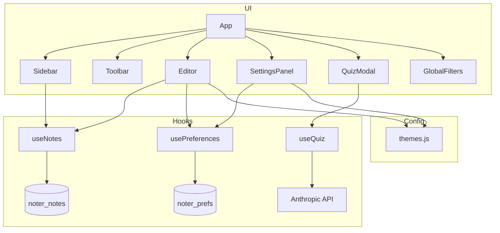

# Project Handoff: Muizo (Notes App)

**Document purpose:** Give another AI agent (or human) enough context to advise on architecture, features, bugs, and next steps without re-exploring the codebase from scratch.

**Last updated:** 2026-05-21  
**Workspace root:** `/Users/fdc-clarence-web/Desktop/notes`  
**Application root:** `/Users/fdc-clarence-web/Desktop/notes/Muizo`  
**Primary product name in UI:** Muizo  
**Internal / legacy naming in code:** `noter_*` (localStorage keys), package name `muizo`

---

## 1. Executive summary

**Muizo** is a **client-only**, **single-page** note-taking web app with a strong **“paper / stationery” aesthetic**. Users write in a `contentEditable` editor with customizable surfaces (ruled yellow pad, plain, notebook, napkin), fonts, writing tools (pen, pencil, marker, etc.), and ink colors. Notes persist in **browser localStorage**. An optional **AI quiz** feature calls the **Anthropic Messages API** from the browser to generate short-answer study questions from the active note’s plain text.

There is **no backend**, **no authentication**, **no routing**, and **no database**. The entire app runs in the browser after `npm run dev` or a static deploy of the Vite `dist/` folder.

The project was built incrementally on **2026-05-21** through a series of Cursor agent sessions (scaffold → themes/hooks → components → layout → quiz → polish → parchment styling). The parent `notes` git repo has only a stub README committed; **`Muizo/` is currently untracked** (`git status` shows `?? Muizo/`).

---

## 2. What the user is trying to build (product intent)

| Goal | Status |
|------|--------|
| Beautiful, tactile writing experience (ruled lines, paper textures, napkin gimmick) | **Implemented** |
| Multiple notes with sidebar list + search | **Implemented** |
| Preferences that feel instant and persist on refresh | **Implemented** |
| Export notes as JSON (Cmd/Ctrl+S) | **Implemented** |
| AI-generated quiz from note content | **Implemented** (requires API key) |
| Highlighting text in editor | **Partially implemented** — pref + `applyHighlight()` exist, **no UI** |
| Separate note `title` field | **Schema only** — title always `''`; sidebar derives display name from content |
| Server sync / multi-device | **Not started** |
| Rich-text toolbar (bold, lists, etc.) | **Not started** — raw HTML via contentEditable |

The aesthetic direction is **warm parchment tones** on chrome (sidebar, topbar, settings) via `parchment.css`, while the **editor area** uses surface-specific colors from `themes.js`.

---

## 3. Repository layout

```
notes/                          # Git workspace (minimal)
├── README.md                   # Single line: "# notes"
├── project_handoff.md          # This file
└── Muizo/                      # The actual application (untracked in git)
    ├── package.json
    ├── package-lock.json
    ├── vite.config.js
    ├── tailwind.config.js
    ├── postcss.config.js
    ├── eslint.config.js
    ├── index.html              # Loads Caveat Google Font
    ├── .gitignore              # Ignores node_modules, dist, *.local
    ├── dist/                   # Production build output (generated)
    ├── node_modules/
    ├── public/                 # (if any static assets)
    └── src/
        ├── main.jsx            # Entry: StrictMode + CSS imports + App
        ├── App.jsx             # Root layout, keyboard shortcuts, napkin overlay
        ├── index.css           # Tailwind directives only
        ├── styles/
        │   └── parchment.css   # App chrome texture system
        ├── config/
        │   ├── themes.js       # Surfaces, fonts, tools, colors, GRID
        │   └── app.js          # name/tagline (mostly unused)
        ├── hooks/
        │   ├── useNotes.js
        │   ├── usePreferences.js
        │   └── useQuiz.js
        └── components/
            ├── GlobalFilters.jsx   # SVG pencil filter defs
            ├── Sidebar.jsx
            ├── Toolbar.jsx
            ├── Editor.jsx
            ├── SettingsPanel.jsx
            ├── QuizModal.jsx
            └── AppShell.jsx        # DEAD CODE — scaffold placeholder, not imported
```

**Approximate size:** ~2,150 lines across 18 source files (excluding `node_modules` / `dist`).

---

## 4. Tech stack (actual versions)

| Layer | Choice | Notes |
|-------|--------|-------|
| UI | React **19.2.6** | Functional components + hooks only |
| Build | Vite **5.4.21** | README incorrectly says "Vite 8" |
| Styling | Tailwind CSS **3.4.19** + `@tailwindcss/typography` | Used alongside heavy inline styles |
| Custom CSS | `parchment.css` | Pseudo-element SVG noise textures |
| State | React `useState` / `useEffect` | No Context, Redux, Zustand |
| Persistence | `localStorage` | Two keys (see §6) |
| AI | Anthropic Messages API | Direct browser `fetch` |
| Routing | None | Single view |
| Tests | None | No test runner configured |
| TypeScript | None | `.jsx` / `.js` only |

**Scripts (`package.json`):**
- `npm run dev` — Vite dev server
- `npm run build` — production bundle (verified working)
- `npm run preview` — serve `dist`
- `npm run lint` — ESLint flat config

---

## 5. Application architecture

### 5.1 Component tree (runtime)

```
main.jsx
└── App.jsx
    ├── GlobalFilters          (hidden SVG, once)
    ├── Sidebar                (notes list, search, new/delete)
    ├── div (main column)
    │   ├── Toolbar            (quiz + settings toggle)
    │   └── div (editor region, position relative)
    │       ├── NapkinOverlay?   (only if prefs.surface === 'napkin')
    │       └── Editor | EmptyState | "Select a note" placeholder
    ├── SettingsPanel          (always mounted; slide via transform)
    └── QuizModal              (null when closed; generates on open)
```

### 5.2 Data flow

```
usePreferences() ──► prefs ──► Editor, SettingsPanel
                    └──► setPref(key, value) ──► localStorage 'noter_prefs'

useNotes() ──► notes[], activeId, activeNote
            └──► createNote / updateNote / deleteNote
            └──► debounced write ──► localStorage 'noter_notes'

useQuiz() ──► generate(html) ──► Anthropic API ──► questions[]
           (only used inside QuizModal)
```

**App-level state (in `App.jsx`):**
- `isSettingsOpen` — toggles settings drawer
- `quizOpen` — mounts quiz flow

### 5.3 Layout dimensions

| Region | Width / height | CSS classes |
|--------|----------------|-------------|
| Sidebar | 240px fixed | `parch-sidebar` |
| Toolbar | 44px height | `parch-topbar` |
| Settings drawer | 320px, full height, fixed right | `parch-settings`, `translateX` animation |
| Editor | flex-1, scrollable | inline styles from `Editor.jsx` |
| Quiz modal | max 520px wide, centered | Tailwind + inline |

---

## 6. Persistence layer (critical detail)

### 6.1 Notes — `localStorage` key: `noter_notes`

**Shape (array of objects):**
```json
{
  "id": "uuid-v4-string",
  "title": "",
  "content": "<p>HTML from contentEditable</p>",
  "createdAt": "ISO-8601",
  "updatedAt": "ISO-8601"
}
```

**Behaviors (`useNotes.js`):**
1. On **first ever load** (empty storage): seeds **one blank note** with a new UUID so the app never starts totally empty.
2. **`activeId`** initialized to first note’s id.
3. **Auto-save:** `useEffect` debounces writes by **500ms** after any `notes` state change (not per-keystroke hook — the whole array is stringified).
4. **`updateNote(id, changes)`** merges partial updates and refreshes `updatedAt`.
5. **`deleteNote`:** removes note; sets `activeId` to neighbor at same index or last note; if none left, `activeId` → `null`.
6. **`title` field is never written** after creation — sidebar uses first line of **stripped HTML content** (max 30 chars) via `getNoteTitle()`.

### 6.2 Preferences — `localStorage` key: `noter_prefs`

**Defaults:**
```js
{
  surface: 'yellow',      // yellow | plain | notebook | napkin
  font: 'serif',          // serif | comic | typewriter | handwritten
  tool: 'pen',            // pen | pencil | marker | fountainPen | crayon
  inkColor: 'midnight',   // see themes.js inkColors
  highlightColor: 'none'  // stored but NO settings UI
}
```

**Behaviors:** immediate `localStorage.setItem` on every pref change (no debounce).

### 6.3 Export

**Cmd/Ctrl+S** in `App.jsx` downloads `notes.json` — full notes array, pretty-printed. Does not include preferences.

---

## 7. Theming system (`src/config/themes.js`)

### 7.1 Grid / ruled lines

- **`GRID = 36`** (pixels) — line height, background gradient period, padding math.
- Editor draws rules with `repeating-linear-gradient` where the rule sits at **`GRID - 1`** px so text baseline sits above the line.
- **`PADDING_TOP = GRID`** (36px) in `Editor.jsx` — aligns first text row to first rule (spec originally said 20px; implementation uses full GRID).

### 7.2 Surfaces

| id | Label | bg | Rules | Special |
|----|-------|-----|-------|---------|
| `yellow` | Yellow | `#FDF5C0` | `#C8BF6A` | Red left margin `3px solid #E8A0A0`, paddingLeft 36px |
| `plain` | Plain | `#FAFAF8` | `#E0DDD4` | Minimal |
| `notebook` | Notebook | `#FDFCFA` | `#D4CCE0` | Purple top border |
| `napkin` | Napkin | `#F2EDE4` | none | Dashed outline; editor `rotate(0.4deg)`; overlay stains in App |

### 7.3 Fonts

| id | Family | Google Font |
|----|--------|-------------|
| serif | Georgia | — |
| comic | Comic Sans MS | — |
| typewriter | Courier New | — |
| handwritten | Caveat | Loaded in `index.html` |

### 7.4 Writing tools

Each tool maps to CSS: `opacity`, `letterSpacing`, `fontWeight`, `fontStyle`, `filter`.

- **pencil** and **crayon** use `filter: url(#pencil-filter)` from `GlobalFilters.jsx` (SVG turbulence + displacement).

### 7.5 Ink colors

9 presets from midnight `#1a1a2e` to light pencil `#a0a0a0`.

### 7.6 Highlight colors (unused in UI)

`highlightColors` array exists; `applyHighlight(color)` in `Editor.jsx` uses deprecated `document.execCommand('hiliteColor', ...)`. **Not wired to SettingsPanel or keyboard.**

---

## 8. Component reference

### 8.1 `App.jsx` (~360 lines)

**Responsibilities:**
- Composes full layout
- `NapkinOverlay` — inline SVG/div stains (crinkles, ketchup, grease) when napkin surface active
- `EmptyState` — illustration + “Create your first note” when `notes.length === 0` (only after user deletes all seeded notes)
- Global keyboard shortcuts:
  - **Cmd/Ctrl+N** → `createNote()`
  - **Cmd/Ctrl+S** → download `notes.json`
  - **Escape** → handled in SettingsPanel + QuizModal (not App)

**Editor visibility logic:**
```text
activeNote exists     → <Editor />
notes.length === 0    → <EmptyState />
else                  → "Select a note or create one..."
```

### 8.2 `Sidebar.jsx`

- New note button, search filter (strips HTML, case-insensitive)
- Note cards: derived title, relative date (Today time / Yesterday / Mon DD)
- Delete on hover with `stopPropagation`
- Right-edge vignette gradient (absolute positioned)

### 8.3 `Toolbar.jsx`

- **Quiz button** (book icon) — disabled without `activeNote`
- **Settings gear** — `data-settings-toggle` attribute for outside-click exclusion
- Uses `parch-topbar` styling (no longer white/slate)

### 8.4 `Editor.jsx`

- **`contentEditable` div** — stores **HTML string** in note content
- `isInternalUpdate` ref prevents feedback loop when swapping notes
- Mount effect sets initial HTML once; `activeId` effect swaps content
- **200ms CSS transitions** on background, color, transform when prefs change
- Exports `applyHighlight()` — **currently orphaned**

### 8.5 `SettingsPanel.jsx`

- Fixed right drawer; visibility via `transform: translateX(100%|0)` — **always in DOM**
- Sections: surface swatches, font cards, tool pills, ink dots
- Outside click + Escape to close
- Does **not** expose highlight color (despite pref existing)

### 8.6 `QuizModal.jsx` + `useQuiz.js`

**Flow:**
1. Open modal → `useEffect` calls `generate()` when `status === 'idle'`
2. Loading skeleton → API → parse JSON array
3. One question at a time; user types answer → Reveal → self-grade 👍/👎
4. Summary screen with score bands (perfect / great / okay / keep studying)
5. Retake reuses same questions without new API call
6. Close resets hook state

**API details (`useQuiz.js`):**
- Model: `claude-sonnet-4-20250514`
- Env: `import.meta.env.VITE_ANTHROPIC_API_KEY`
- Endpoint: `POST https://api.anthropic.com/v1/messages`
- Header: `anthropic-dangerous-direct-browser-access: true` (**exposes API key in client**)
- System prompt asks for JSON array `{ question, answer, type: 'short' }` (1–10 questions by content length)
- Strips HTML before sending
- Parses JSON strictly; fallback regex extract `[...]` if model adds prose

**Error codes:**
| code | Meaning |
|------|---------|
| `missing_key` | No `VITE_ANTHROPIC_API_KEY` |
| `empty_note` | Stripped text empty |
| `api_error` | HTTP or parse failure |

**Security note for advisors:** Vite env vars prefixed with `VITE_` are **bundled into client JS**. This is acceptable for local prototyping only; production should use a backend proxy.

### 8.7 `GlobalFilters.jsx`

Hidden SVG defining `#pencil-filter` for pencil/crayon tools.

### 8.8 `AppShell.jsx` — **dead code**

Original Vite scaffold placeholder. **Not imported anywhere.** Safe to delete or repurpose.

---

## 9. Styling architecture (two parallel systems)

### 9.1 Tailwind

- `index.css` — `@tailwind base/components/utilities`
- Used for layout utilities (`flex`, `h-screen`, quiz modal Tailwind classes)
- `@tailwindcss/typography` installed; minimal use (prose in dead AppShell only)

### 9.2 `parchment.css` — app chrome

**CSS variables on `:root`:** `--parch-dark`, `--parch-mid`, `--parch-faint`, `--parch-accent`, etc.

**Textured regions** (`.parch-topbar`, `.parch-sidebar`, `.parch-settings`):
- Solid parchment background colors
- `::before` pseudo with **URI-encoded SVG fractalNoise** tile (opacity 0.10)
- Children need `position: relative; z-index: 1`

**Utility classes:** `.parch-btn`, `.parch-btn-primary`, `.parch-input`, `.parch-text*`, `.parch-note-item`, `.parch-divider`

### 9.3 Inline styles

Editor, quiz modal, napkin overlay, many buttons use **inline `style={{}}`** for precise visual design. Refactoring to CSS modules would be non-trivial.

---

## 10. Environment & configuration

### 10.1 Required for quiz feature

Create **`Muizo/.env`** (not in repo; `.gitignore` has `*.local`):

```env
VITE_ANTHROPIC_API_KEY=sk-ant-...
```

Restart dev server after adding. Without this, quiz shows “API key not found” UI.

**There is no `.env.example` checked in.**

### 10.2 Vite config

Default — only `@vitejs/plugin-react`. No path aliases, no env define overrides.

### 10.3 ESLint

Flat config; React hooks + react-refresh rules. Several intentional `eslint-disable-next-line` for editor mount/sync effects.

---

## 11. Git & deployment state

| Item | State |
|------|-------|
| Parent repo | `/Users/fdc-clarence-web/Desktop/notes` |
| Commits | `b289ab7 first commit` (README only) |
| `Muizo/` | **Untracked** — entire app not committed |
| `.env` | Not present |
| `dist/` | Build succeeds; generated artifacts exist locally |

**Deploy:** Any static host (Vercel, Netlify, S3, GitHub Pages) can serve `Muizo/dist` after `npm run build`. Remember API key exposure if quiz is enabled.

---

## 12. Development history (Cursor sessions, 2026-05-21)

Chronological feature build (from agent transcripts in `.cursor/projects/.../agent-transcripts/`):

1. **Scaffold** — React + Vite + Tailwind v3, folder structure (`af480ee2-...`)
2. **`themes.js`** — GRID, surfaces, fonts, tools, colors (`d686930c-...`)
3. **`useNotes` + `usePreferences`** hooks (`22b6e052-...`)
4. **`GlobalFilters.jsx`** — pencil SVG filter (`1ba81e17-...`)
5. **`Editor.jsx`** — contentEditable + ruled lines (`27d9a7ec-...`)
6. **`Sidebar.jsx`** (`7fed87aa-...`)
7. **`SettingsPanel.jsx`** (`4a6aa0b3-...`)
8. **`QuizModal.jsx` + `useQuiz.js`** (`4a6aa0b3-...`, continued)
9. **`App.jsx` layout** — compose all pieces, napkin overlay, seed note (`a54528cc-...`)
10. **Polish pass** — transitions, empty state, shortcuts, napkin rotation, persistence (`4c877cb8-...`)
11. **`parchment.css`** — texture system on sidebar/topbar/settings (`19d76cf9-...`)
12. **This handoff doc** (`9c115f40-...`)

---

## 13. Known gaps, inconsistencies, and technical debt

### 13.1 Incomplete features

| Item | Detail |
|------|--------|
| **Highlighting** | `highlightColor` in prefs; `highlightColors` + `applyHighlight()` exist; no UI or shortcut |
| **Note titles** | `title` field always empty; display title computed from content |
| **AppShell.jsx** | Unused scaffold |
| **README accuracy** | Says Vite 8; actual Vite 5.4.21 |

### 13.2 Naming inconsistencies

- Product: **Muizo** / package `muizo`
- Storage keys: **`noter_notes`**, **`noter_prefs`**
- Consider renaming keys only with migration logic (breaking change for existing users)

### 13.3 contentEditable risks

- Pasted content can inject arbitrary HTML (XSS risk if notes ever rendered unsafely elsewhere — currently same-origin editor only)
- No sanitization on save
- Browser undo/redo behavior varies
- `document.execCommand` for highlights is deprecated

### 13.4 Quiz / AI limitations

- **Self-graded only** — no LLM comparison of user answer vs model answer
- System prompt has awkward duplication: *"generate 1-10 questions depending on the amount of notes. quiz questions"*
- Question count not validated server-side; model may return markdown despite instructions
- API key in browser bundle

### 13.5 Edge cases

| Scenario | Behavior |
|----------|----------|
| First visit | One empty note auto-created — **EmptyState rarely seen** until all notes deleted |
| Delete last note | `activeId` null; empty state or placeholder |
| Quiz with empty note | Error UI `empty_note` |
| Switch note while editing | `activeId` effect replaces editor HTML (unsaved content already in state from last input) |
| Hard refresh | Notes + prefs restore from localStorage |
| localStorage quota exceeded | No error handling — silent failure possible |

### 13.6 Accessibility

- Some `aria-*` on buttons/dialogs
- `contentEditable` without robust screen-reader labeling
- Color-only ink selection (has `aria-label` per swatch)

### 13.7 Performance

- Fine for hundreds of notes; entire array JSON.stringify on each debounced save
- No virtualization on sidebar list

---

## 14. Keyboard shortcuts (complete list)

| Shortcut | Action | Where handled |
|----------|--------|---------------|
| Cmd/Ctrl+N | New note | `App.jsx` |
| Cmd/Ctrl+S | Download `notes.json` | `App.jsx` |
| Escape | Close settings | `SettingsPanel.jsx` |
| Escape | Close quiz | `QuizModal.jsx` |

**Not implemented:** shortcuts for highlight, surface switching, or bold/italic.

---

## 15. How to run locally

```bash
cd /Users/fdc-clarence-web/Desktop/notes/Muizo
npm install
# Optional for quiz:
echo 'VITE_ANTHROPIC_API_KEY=your-key' > .env
npm run dev
```

Open the URL Vite prints (typically `http://localhost:5173`).

**Verify build:**
```bash
npm run build   # ✓ succeeds (~665ms)
```

---

## 16. File-by-file responsibility matrix

| File | Role |
|------|------|
| `main.jsx` | Bootstrap React, import global CSS |
| `App.jsx` | Layout orchestration, shortcuts, napkin/empty states |
| `hooks/useNotes.js` | Note CRUD + localStorage |
| `hooks/usePreferences.js` | User prefs + localStorage |
| `hooks/useQuiz.js` | Anthropic API client |
| `config/themes.js` | All visual tokens |
| `config/app.js` | Static app name (unused in main UI) |
| `components/Sidebar.jsx` | Note list UI |
| `components/Toolbar.jsx` | Top actions |
| `components/Editor.jsx` | Writing surface |
| `components/SettingsPanel.jsx` | Preferences drawer |
| `components/QuizModal.jsx` | Quiz UX |
| `components/GlobalFilters.jsx` | SVG filters |
| `styles/parchment.css` | Chrome styling |
| `index.css` | Tailwind entry |
| `index.html` | Title, Caveat font |

---

## 17. Suggested questions for an advising agent

When the user asks another AI for help, these are high-value directions:

1. **Product:** Should `title` be a first-class field or keep derived titles?
2. **Security:** Move Anthropic calls to a small backend vs. accept client-key risk?
3. **Editor:** Replace `contentEditable` with TipTap/Lexical/CodeMirror, or keep minimal?
4. **Highlights:** Finish highlight UI — toolbar button vs. keyboard vs. selection menu?
5. **Data:** Add import JSON, sync, or export including prefs?
6. **Git:** Commit `Muizo/` — what should `.env.example` contain?
7. **Testing:** Vitest + Testing Library for hooks and persistence?
8. **Polish:** Mobile layout (sidebar collapse?), PWA offline?
9. **Quiz:** AI-assisted answer checking vs. self-report?
10. **Cleanup:** Remove `AppShell.jsx`, align `noter_*` → `muizo_*` keys with migration?

---

## 18. Quick reference — localStorage keys

| Key | Content |
|-----|---------|
| `noter_notes` | `Note[]` JSON |
| `noter_prefs` | `Preferences` JSON |

**Clear all app data (browser console):**
```js
localStorage.removeItem('noter_notes')
localStorage.removeItem('noter_prefs')
location.reload()
```

---

## 19. Dependency graph (conceptual)



---

## 20. Contact context for the advising agent

- **User workspace:** macOS, Cursor IDE, zsh
- **User was actively editing:** `Toolbar.jsx` (quiz + settings buttons) at time of handoff request
- **No open blockers reported** — build passes, app is feature-complete for the spec given in sessions
- **Primary risk if shipping publicly:** exposed API key + untracked git state + no `.env.example`

---

*End of handoff document. For live code truth, prefer reading `Muizo/src/` over this doc if the codebase has diverged.*
